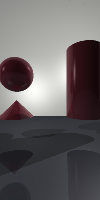

# JBTracer

A Ray Tracer written in the Rust programming language.

## Deployment

This application depends on the crates:
  - `num = "0.2"`
  - `chrono = "0.4"`
  - `rand = "0.7.2"`
  
 ## Features
 
 JBTracer can draw six primitive shapes:
   - Plane
   - Cone
   - Cylinder
   - Sphere
   - Triangle
   - SmoothTriangle (triangle with interpolated normals)
   
These primitive types support fully customizable materials, which allow custom coloring, reflectiveness and translucency:

*All image primitives, featuring shapes utilizing reflection and refraction.*

---

Four material patterns are available:
  - Checkered
  - Striped
  - Ringed
  - Gradient
  
These patterns can be drawn to the surface of any primitive:

---

Multiple Point Lights can be used to illuminate scenes, and are used to generate dynamic shadows.

---

JBTracer can also draw constructive geometries by evaluating unions, intersection and differences of the primitive types.

*The shape on the left was created from the difference of a reflective cube from a sphere, while the shape on the right is the reflective union of a sphere and a cone.*

---

An object file reader has been included as well. JBTracer can read basic object files, and create grouped objects (either with or without vertex normals) by parsing the data and generating Triangle or SmoothTriangle objects.

*This cow model was loaded from an obj file.*

*Both teapots were loaded from obj files, but the teapot on the left was loaded from a file with vertex normals, and it utilizes normal interpolation. The teapot on the left is comprised of fewer than half the number of triangles than the teapot on the right is constructed from.*

---

The screensize of the output image can be adjusted by altering the dimensions of the `Canvas` object. The image is saved in the PPM format.

*200x200px*

*200x100px*

*100x200px*

---

Anti-Aliasing support is also available. The image can be output with no Anti-Aliasing, or it can be output using Anti-Aliasing sample rates of either four or sixteen samples per pixel by adjusting which coloring function is called in the main rendering loop.

*No Anti-Aliasing*

*Anti-Aliasing sample rate of 16 rays per pixel*

## Tests

A full test suite has been implemented, and is spread out across `_test.rs` files within the `rendering` module. The entire suite can be run by executing `cargo test`.
 
